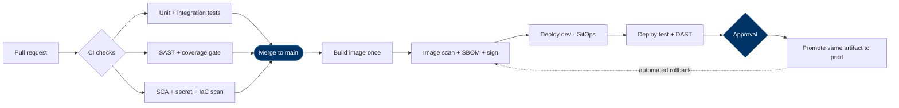

# CI/CD & DevSecOps

"CI/CD" means very different things to different teams, so this page defines the
**mandatory attributes** every pipeline must have, regardless of the tooling. We provide
**reusable templates** that already implement them. You **MAY** use other tooling, but
your pipeline **MUST** inherit the mandatory attributes below.

!!! tip "Use the templates"
    The fastest path to compliance is the standard pipeline template and Helm chart.
    They come with SAST, dependency/secret/image scanning, SBOM, and signing wired in.
    Reusing them is what the [compliance scan](#enforcement) checks for.

---

## Source control & change flow

**MUST:**

- Code, infrastructure-as-code, configuration, pipeline definitions, and documentation
  all live in **GitHub Enterprise**.
- **Protected `main`**: no direct pushes; changes land via **pull request** with at
  least one review (`CODEOWNERS`-enforced) and passing status checks.
- **Branch protection** + required checks + linear history.
- **Signed commits** (Tier 1/2).
- No secrets in the repository, ever (see scanning below).

## The mandatory pipeline attributes

Every pipeline **MUST** include the following stages, and they **MUST** be able to
**fail the build / block the merge or deploy** (not just warn):

| Stage | Control | Tooling (standard) | Gate |
|---|---|---|---|
| **Build** | Reproducible build from source | — | MUST |
| **Unit + integration tests** | Automated, run on every PR | language-native | MUST |
| **Coverage gate** | Enforced threshold | SonarQube | MUST — Tier1 ≥85%, Tier2 ≥80%, Tier3 ≥70% |
| **SAST** | Static analysis / code smells / quality gate | SonarQube | MUST |
| **SCA** | Vulnerable & out-of-date dependencies | GitHub Advanced Security / Dependabot | MUST |
| **Secret scanning** | No credentials/keys committed | GitHub secret scanning | MUST |
| **Container image scan** | OS + library CVEs in the image | Sysdig / Trivy | MUST |
| **IaC scan** | Misconfig in manifests/Helm/Terraform | policy scanner | SHOULD |
| **DAST** | Running-app vulnerability scan (OWASP) | OWASP ZAP | SHOULD (Tier 1 MUST) |
| **SBOM** | Software bill of materials | CycloneDX / SPDX | Tier1/2 MUST, Tier3 SHOULD |
| **Artifact signing + provenance** | Signed image + build provenance | cosign / Sigstore, SLSA | Tier1/2 MUST |

> See [Security & Privacy](#) for vulnerability-management SLAs (how fast findings of
> each severity must be fixed).

## Security by design in the pipeline

This operationalises "shift-left security":

- **OWASP** — design and test against the OWASP Top 10 / ASVS; DAST in the pipeline for
  web apps.
- **Dependency hygiene** — Dependabot (or equivalent) raises PRs for vulnerable/outdated
  dependencies; pin dependencies; keep base images current.
- **Software supply chain** — produce an **SBOM**, **sign** artifacts, and generate
  **build provenance** (SLSA) so we can verify what we deploy and respond to the next
  dependency-level incident.
- **Secrets** — never in code; injected at runtime from a secrets manager / sealed
  secrets. Secret scanning blocks accidental commits.

## Build once, promote the same artifact

**MUST:** build an **immutable** artifact once and promote *that same artifact* through
environments — never rebuild per environment. In OpenShift you have **four**
environments: **dev, test, prod, and tools**. (Need a separate training/practice
environment? Either request an additional namespace or design test to double as
training — decide at [design time](nfrs.md).)

## Deployment

**MUST:**

- **Helm** charts (use the standard chart) for packaging/deploy.
- **GitOps** (e.g. ArgoCD/Flux): the cluster state is declared in Git and reconciled —
  deployments are auditable and reproducible, and rollback is "revert the commit".
- A defined, **automated rollback** path.

**SHOULD (Tier 1/2):** progressive delivery — **blue/green or canary** releases and
**feature flags** — so a bad release affects few users and can be rolled back instantly.
Combined with the [graceful shutdown + readiness](application-resilience.md#7-health-checks-probes)
patterns, deployments should be **zero-downtime**.

## Reference pipeline shape

On the **pull request**, the checks gate the *merge*. Only **after merge to `main`** is
the immutable image built once and promoted through environments.

## Enforcement

Compliance is **measured**, not assumed:

1. **Standard templates** implement all mandatory attributes out of the box.
2. A scheduled **compliance scan** inspects every repository/pipeline and flags any that
   are not using the standard template or are missing required controls (no SAST, no
   image scan, no signing, etc.). Non-compliant repos are reported (and notified) daily.
3. **Cluster admission policy** (e.g. Kyverno/Gatekeeper) **MAY** reject workloads that
   fail baseline rules (unsigned images, no resource limits, no probes).
4. The result feeds the project's
   [ServiceNow readiness record](../reference/servicenow-process.md).
5. **DORA metrics** (deployment frequency, lead time, change-failure rate, MTTR) track
   whether delivery is actually healthy over time.

---

## Quick checklist

- [ ] Everything in GitHub Enterprise; `main` protected; PR + `CODEOWNERS` review
- [ ] Pipeline-as-code, using the standard template (or inherits all mandatory attributes)
- [ ] Tests + enforced coverage gate (per tier)
- [ ] SAST, SCA, secret scan, image scan — all build-breaking
- [ ] SBOM produced; artifacts signed; provenance generated (Tier 1/2)
- [ ] DAST/OWASP for web apps (Tier 1 MUST)
- [ ] Immutable artifact built once, promoted dev → test → prod
- [ ] Helm + GitOps; automated rollback; progressive delivery for Tier 1/2
- [ ] No secrets in repo; runtime secrets from a manager
