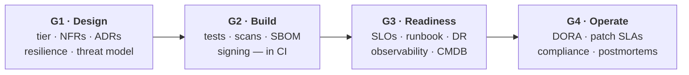

:material-shield-check: Draft · MVP for review

# Application Development, Readiness &amp; Resilience Framework

Guardrails for building, hardening, and handing over applications that are
<strong>supportable, secure, and resilient</strong> — for internal teams, contractors, and vendors alike.

[Build your checklist](checklist/checklist-generator.md){ .md-button .md-button--primary }
[Start here — how to use this](start-here.md){ .md-button }
[Production readiness review](readiness/production-readiness-review.md){ .md-button }

:material-clipboard-check-outline:{ .lg } &nbsp; **Building, retrofitting, or handing over an app?** Answer six questions, tick off what's already done, and walk away with a one-pager of what's left — no need to read the whole site.

[Build your checklist →](checklist/checklist-generator.md){ .md-button .md-button--primary }

!!! tip "Use this at the *start* of a project, not the end"
    This replaces the legacy handover-time *Application Readiness Checklist*. The
    difference is **timing and intent**: these are **design and build guardrails** —
    read them *before* you start solutioning. The readiness review is the final gate,
    not the first conversation.

4lifecycle gates, design → operate

3criticality tiers, right-sized

12resilience patterns, with examples

~50%of resilience is the app's job, not infra

## Why this exists

We support a large and growing fleet of applications. Too many arrive built in a way
that cannot be operated reliably — they fall over during routine updates, keep state in
memory, have no health checks, no automated tests, no observability, and no runbook.
Infrastructure can provide at most **half** of resilience; the application itself has to
be built for it. This framework makes those expectations explicit, with examples, so
teams build the right thing the first time.

## Explore the framework

-   :material-clipboard-check-outline:{ .lg .middle } &nbsp; __Build your checklist__

    ---

    Answer six questions → a right-sized checklist you tick off → a one-pager of what's
    left. The fastest way in.

    [:octicons-arrow-right-24: Start the checklist](checklist/checklist-generator.md)

-   :material-layers-triple:{ .lg .middle } &nbsp; __Criticality tiers__

    ---

    Tier 1 / 2 / 3 decide which requirements are mandatory — so a low-risk tool isn't
    over-engineered and a critical system isn't under-built.

    [:octicons-arrow-right-24: Pick your tier](principles/criticality-tiers.md)

-   :material-shield-bug:{ .lg .middle } &nbsp; __Application resilience__

    ---

    The 12 patterns that prevent most production incidents: statelessness, timeouts,
    safe retries, idempotency, circuit breakers, probes, graceful shutdown, and more.

    [:octicons-arrow-right-24: Build it to stay up](design-build/application-resilience.md)

-   :material-pipe:{ .lg .middle } &nbsp; __CI/CD &amp; DevSecOps__

    ---

    The mandatory pipeline attributes — tests, SAST/SCA/secret/image scanning, SBOM,
    signing — plus reusable templates with an approved "out".

    [:octicons-arrow-right-24: Pipeline standards](design-build/cicd-devsecops.md)

-   :material-format-list-checks:{ .lg .middle } &nbsp; __Non-functional requirements__

    ---

    Each NFR defined, the right question to ask the business, and a fillable worksheet
    — including the RTO/RPO conversation that drives cost.

    [:octicons-arrow-right-24: Capture your NFRs](design-build/nfrs.md)

-   :material-rocket-launch:{ .lg .middle } &nbsp; __Production readiness review__

    ---

    The go-live gate as evidence-based sign-off — and a ready-made gap assessment for
    retrofitting applications already in production.

    [:octicons-arrow-right-24: Pass the gate](readiness/production-readiness-review.md)

-   :material-clipboard-check-outline:{ .lg .middle } &nbsp; __ServiceNow tracking__

    ---

    How each project's readiness is recorded, signed off, and linked to the CMDB — the
    "who applied it to which project" audit trail.

    [:octicons-arrow-right-24: The process](reference/servicenow-process.md)

-   :material-shield-lock:{ .lg .middle } &nbsp; __Security &amp; privacy__

    ---

    Auth models (IDIR / Keycloak / BC Services Card), access management, data
    classification, STRA/PIA, encryption, and vulnerability-management SLAs.

    [:octicons-arrow-right-24: Secure it by design](design-build/security-privacy.md)

-   :material-chart-line:{ .lg .middle } &nbsp; __Observability__

    ---

    Metrics in Sysdig, structured logs to the Hive, tracing, SLIs/SLOs, and alerts
    that are actionable and routed to the on-call owner.

    [:octicons-arrow-right-24: Make it observable](design-build/observability.md)

-   :material-database-cog:{ .lg .middle } &nbsp; __Data management__

    ---

    Governance roles, classification, records management, retention/archival/deletion,
    data interoperability, and reporting — the data outlives the app.

    [:octicons-arrow-right-24: Govern the data](design-build/data-management.md)

## The four gates

Requirements are organised around four lightweight gates across the lifecycle. Each is
**right-sized by [criticality tier](principles/criticality-tiers.md)**.

| Gate | When | Owner | What it checks |
|---|---|---|---|
| **G1 · Design** | Before build | Architect / ARB | Tier, [NFRs](design-build/nfrs.md), resilience approach, ADRs, threat model |
| **G2 · Build** | Continuously in CI/CD | Pipeline (automated) | Tests + coverage, [SAST/SCA/secret/image scans](design-build/cicd-devsecops.md), SBOM, signing |
| **G3 · Production Readiness** | Before go-live | Operations / SRE | [PRR](readiness/production-readiness-review.md): SLOs, runbook, DR test, observability, CMDB |
| **G4 · Operate** | Ongoing | Product owner / vendor | DORA metrics, patch SLAs, compliance scan, postmortems |

## Who this is for

-   :material-account-tie:{ .lg .middle } __Product owners &amp; business__

    Understand the early decisions: criticality, recovery needs, support hours, cost.

-   :material-drawing:{ .lg .middle } __Architects &amp; BAs__

    Capture the non-functional requirements and record architecture decisions.

-   :material-laptop:{ .lg .middle } __Developers &amp; vendors__

    Build to the CI/CD, security, and resilience guardrails; reuse the templates.

-   :material-server-network:{ .lg .middle } __Operations &amp; SRE__

    Run the Production Readiness Review before accepting an application.

## How requirements are written

This framework uses [RFC 2119](https://www.rfc-editor.org/rfc/rfc2119) keywords:

- **MUST** — required. Non-compliance blocks the relevant gate (subject to a documented waiver).
- **SHOULD** — strongly recommended. Deviation should be justified in an ADR.
- **MAY** — optional / situational.

Which `MUST`s apply to *your* application depends on its
**[criticality tier](principles/criticality-tiers.md)** — start there.

## How this is enforced

A document alone does not change behaviour. The expectations here are backed by:

1. **Reusable pipeline &amp; Helm templates** that bake in the mandatory build-time controls.
2. **An automated compliance scan** that flags repositories not using the standard templates.
3. **A ServiceNow readiness record** that tracks per-project sign-off and links to the CMDB.
4. **Contract / SOW clauses** that make the mandatory items contractual deliverables.

---

This is a living document. Propose changes via pull request · Last reviewed: see page footer / Git history.

