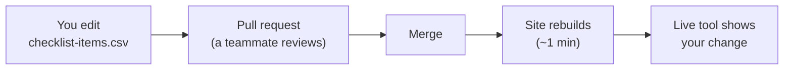

# Change the checklist (no code)

**Who this is for:** product owners, business analysts, and managers — anyone who
owns *what* the checklist asks for. You don't need to be a developer, and you don't
need to touch any code.

!!! tip "The one thing to know"
    The entire checklist is **one spreadsheet** — `checklist-items.csv`. Change a row
    in it, and both the live **Build Your Checklist** tool and the polished Excel copy
    follow. One place, one edit.

## What you can change

| You want to… | How |
|---|---|
| **Reword** an item, its rationale, or the evidence it asks for | Edit the text in that row |
| **Change when it's required** (per criticality tier) | Set the *Tier 1 / 2 / 3* cell to `Must`, `Should`, `Optional`, or `N/A` |
| **Limit an item to a platform or context** | Set *Applies to* — e.g. `Salesforce`, `OpenShift`, `Public-facing`, `Vendor-built` |
| **Add a new item** | Add a new row and fill in the columns |
| **Remove an item** | Delete its row |
| **Add a new section** | Type a new *Section* name (and its gate) on a row |

Each row is one checklist item. The columns are: **Section, Gate, Item, Why,
Evidence, Covers, Tier 1, Tier 2, Tier 3, Applies to, More info.** Full definitions
are on [Maintaining the Checklist](maintaining-the-checklist.md).

## How to make the change

You have two options. The browser one is easiest and needs nothing installed.

### Option A — edit in the browser (recommended)

1. Open the file on GitHub:
   [`docs/checklist/checklist-items.csv`](https://github.com/bcgov/app-readiness-framework/blob/main/docs/checklist/checklist-items.csv).
2. Click the **pencil ✏️ (Edit)** button. GitHub shows the spreadsheet as editable rows.
3. Make your change — edit a cell, add a row, or delete one.
4. Click **Commit changes…**, add a one-line note of what you changed, and choose
   **"Create a new branch and start a pull request."**
5. That opens a **pull request** — a request for a teammate to review your change.
   A reviewer approves it, and once it's merged the site **rebuilds itself in about
   a minute.** The live tool then serves your updated checklist.

### Option B — edit in Excel

1. Download `checklist-items.csv` from the repo and open it in **Excel**.
2. Edit rows as you like.
3. **Save as → CSV UTF-8 (Comma delimited)**, keeping the file name `checklist-items.csv`.
4. Hand it to whoever manages the repo (or upload it through GitHub) to open the same
   pull request as above.

!!! warning "Keep the header row"
    Don't rename or reorder the top row of column names — the tool matches columns by
    those names. Just edit the rows underneath.

## What happens after you save

- **Nothing goes live until it's reviewed and merged.** That review step is the
  guardrail — it's not a hurdle, it's the audit trail for a governance document.
- Once merged, anyone who opens the checklist page next gets the new version. No app
  update, no redeploy on your part.

## What still needs a developer

You own the *content*. A developer is only needed to change *how the tool behaves*:

- New **platform tooling** (e.g. adding a new platform and its monitoring/logging tool).
- The tool's **layout, styling, or exports** (PDF, ServiceNow CSV, etc.).
- Refreshing the **Excel copy** after a CSV change — one command,
  `python scripts/build-checklist-xlsx.py` (see [Maintaining the Checklist](maintaining-the-checklist.md)).

If you're not sure whether something is content or behaviour, open the pull request
anyway and ask in it — that's what the review is for.
