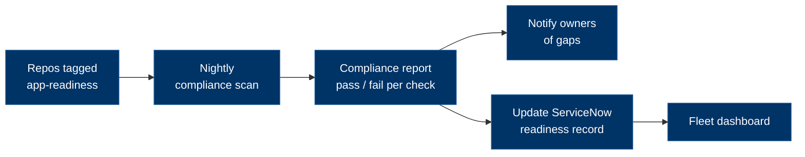

# Compliance & enforcement

!!! quote "The core principle"
    A guardrail nobody checks is a suggestion. Compliance here is **measured
    automatically** and fed back into the readiness record — not self-reported. This is
    the part that stops *"we tell people to do things, they just ignore it."*

The checklist tells a team what to do. This page is how we **verify it actually got
done** — without relying on anyone to report honestly. It is the operational answer to
the enforcement gap: automated tooling that inspects every repo and flags what falls
short, modelled on the overnight compliance job already proven on the AG OpenShift fleet.

---

## Two layers of enforcement

| Layer | Where | What it catches |
|---|---|---|
| **Build-time gates** | In each pipeline | A missing/failing control **breaks the build** — see [CI/CD & DevSecOps](../design-build/cicd-devsecops.md#the-mandatory-pipeline-attributes) |
| **Org-wide scan** | Scheduled job across all repos | Repos that **bypass the standard** entirely — no pipeline, no scans, not on the template |

The build-time gate only helps if a team uses the standard pipeline. The **scan** is what
catches the team that didn't — independent of whether they ran anything.

## The compliance scan

A **nightly** job that, for every repository tagged with the `app-readiness` GitHub
topic, checks each mandatory control, records the result, notifies owners of gaps, and
updates the [ServiceNow readiness record](servicenow-process.md).

### What it checks — and how

| Check | How it's detected | Maps to checklist |
|---|---|---|
| On the standard pipeline template (or inherits the attributes) | Workflow references the template / contains the required jobs | Build & supply chain |
| Protected `main` + required checks + `CODEOWNERS` | GitHub branch-protection API | Build & supply chain |
| SAST / quality gate (SonarQube / CodeQL) | Workflow job present; Sonar project exists | Build & supply chain |
| SCA (Dependabot / dependency review) | Repo security config | Build & supply chain |
| Secret scanning enabled | GitHub API | Build & supply chain |
| Container image scan (Trivy / Sysdig) | Workflow job present | Build & supply chain |
| SBOM generated | Workflow step / released artifact | Build & supply chain |
| Artifact signing + provenance (cosign / SLSA) | Workflow step / attestation present | Build & supply chain |
| Coverage gate met | Sonar quality-gate status | Build & supply chain |

Each result is **pass / fail / n-a** per repo, per check.

### How repos are found

The scan enumerates repositories by the **`app-readiness` topic** (or an org allowlist),
so a team opts a service in by tagging it — and a service that *should* be tagged but
isn't is itself a finding.

### What it produces

1. A **compliance report** — machine-readable JSON plus a human-readable summary, per repo, per check.
2. A **daily notification** to each non-compliant repo's owners listing the specific gaps.
3. A **fleet roll-up** — compliant vs non-compliant across all services (feeds the [portfolio dashboard](../dashboard.md)).

## The feedback loop into ServiceNow

The scan writes its result back to the readiness record, so the checklist's build-time
items **tick themselves** and status is tracked, not claimed:

- Sets `u_g2_build = true` when all Build & supply-chain checks pass.
- Recalculates `u_readiness_score`.
- Attaches the report URL to `u_evidence_url`.

> The scan itself ships as a starter you can run — see
> [Templates & Starters → Compliance scan](../starters/index.md#compliance-scan-scheduled).

## When a repo is non-compliant

- **Notify** — a daily message to the owners with the exact gaps and links to the fix.
- **Block** — an unmet `MUST` blocks the relevant gate (G2/G3) unless a **time-boxed
  waiver** with a named owner and remediation date is recorded in the readiness record
  (`u_waivers`).
- **Escalate** — persistent non-compliance past the remediation date escalates to the
  architecture / operations owner.

## Rollout — report first, then enforce

Turning this on hard on day one would just generate noise and resentment. Phase it:

1. **Pilot (report-only)** — run against **CSA** before the Deloitte handover. Show the
   gaps; fix nothing automatically.
2. **Fleet (report-only)** — expand to the ~106 OpenShift apps as a **gap assessment**;
   the output is a prioritised remediation backlog (resilience & observability first).
3. **Enforce** — once teams have had time to close gaps, enable **gate-blocking** for new
   builds and changes.

!!! tip "DORA alongside compliance"
    Compliance says *"are the controls present?"* — [DORA
    metrics](../design-build/cicd-devsecops.md#enforcement) (deploy frequency, lead time,
    change-failure rate, MTTR) say *"is delivery actually healthy?"* Track both; a repo can
    be compliant and still shipping badly.
