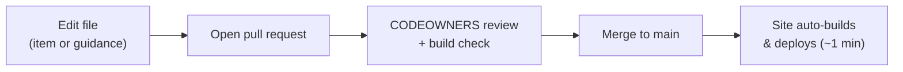

# Maintaining the checklist

The checklist is a **living document** — anyone on the team can update it, not just the
person who built it. This page is how.

!!! tip "The short version"
    The checklist items live in **one spreadsheet** — `docs/checklist/checklist-items.csv`
    — which you edit in **Excel** (no code). Save it → open a pull request → on merge to
    `main`, the site **rebuilds and deploys itself** in about a minute. The tool reads that
    spreadsheet and builds the whole checklist from it.

## What lives where

| You want to change… | Edit this |
|---|---|
| A **checklist item** (title, why, evidence, tiers, when it applies) | `docs/checklist/checklist-items.csv` — **open in Excel** |
| The **detailed guidance** behind an item | the matching Markdown page under `docs/…` |

That's it — one spreadsheet drives the tool. You do **not** need to touch any JavaScript.

## Anatomy of a checklist item

Each **row** of `checklist-items.csv` is one checklist item. The columns are:

| Column | What it is |
|---|---|
| **Section** | The group it appears under (e.g. `Design & decisions`, `Observability`). Type a new section name to create one. |
| **Gate** | The lifecycle gate — `G1` Design, `G2` Build, `G3` Production Readiness. |
| **Item** | The item itself, written as an action ("Do X"). |
| **Why** | One sentence of justification (shown under the item). |
| **Evidence** | What proves it's done (becomes the evidence prompt). |
| **Covers** | Optional "what this rolls up" line — the sub-items a single row stands in for. |
| **Tier 1 / Tier 2 / Tier 3** | When it applies per criticality tier: `Must`, `Should`, `Optional`, or `N/A`. |
| **Applies to** | `All`, or restrict it: `Salesforce`, `OpenShift`, `Public cloud`, `Public-facing`, or `Vendor-built`. |
| **More info** | The "More info ↗" link — a repo-relative path (`../../design-build/observability/`) or a full `https://…` URL. |

!!! note "Platform-aware wording"
    In any text column you can use the tokens `{{MONITOR}}`, `{{LOGS}}`, and `{{SECRETS}}`.
    The tool swaps them for the right tool per platform — e.g. `{{MONITOR}}` becomes
    **Sysdig** on OpenShift and **Salesforce Event Monitoring** on Salesforce.

## Common edits

- **Reword an item** — edit the *Item*, *Why*, or *Evidence* cell.
- **Change when it's mandatory** — change a *Tier* cell (`Must` → `Should`, etc.).
- **Restrict it** — set *Applies to* (`OpenShift`, `Salesforce`, `Public-facing`, `Vendor-built`).
- **Add an item** — add a new row and fill the columns.
- **Remove an item** — delete the row.
- **Add a section** — type a new *Section* name (and its *Gate*) on a row; it appears in first-seen order.

!!! warning "Save as CSV, keep the header row"
    Excel may offer to save as `.xlsx` — choose **CSV UTF-8 (Comma delimited)** and keep the
    file name `checklist-items.csv`. Don't rename or reorder the header row; the tool matches
    columns by their header names.

To change the **guidance** behind an item, edit the relevant Markdown page under `docs/`
(plain Markdown — headings, lists, tables, admonitions).

## Refreshing the Excel copy

The polished Excel workbook is **generated from the same CSV**, so it never drifts.
After editing `checklist-items.csv`, regenerate it:

```bash
pip install openpyxl
python scripts/build-checklist-xlsx.py
```

This reads the CSV, resolves the platform tokens and links, and writes
`Application-Readiness-Checklist.xlsx`. The CSV is the master — don't hand-edit the
`.xlsx`. See [`scripts/README.md`](https://github.com/bcgov/app-readiness-framework/blob/main/scripts/README.md).

!!! info "Safety fallback (for developers)"
    `docs/javascripts/generator.js` still contains a copy of the catalogue as a hard-coded
    fallback, used only if the CSV can't be loaded. The **CSV is the source of truth**; the
    fallback is a backstop, not the place to make edits.

## The change flow



1. Edit the file (in GitHub's web editor, or a branch locally).
2. **Open a pull request.** The `CODEOWNERS` review and the build check run automatically.
3. **Merge to `main`.** The *Publish framework site* GitHub Action builds the site with
   `mkdocs build --strict` and deploys it to GitHub Pages.
4. It's live within about a minute at the site URL.

## Preview locally (optional)

```bash
pip install -r requirements.txt
mkdocs serve
# open http://localhost:8000
```

!!! warning "Check item edits in the browser"
    `mkdocs build` validates the Markdown and links, but **not** the checklist rows. After
    editing `checklist-items.csv`, open the checklist page and generate a list to confirm your
    change renders and nothing broke.

## Tips

- Keep titles action-oriented; keep **why** to one sentence.
- A named tool is a **recommended default** — mandatory only where the platform provides
  it; otherwise allow an equivalent with an ADR (see the *Recommended vs required* note on
  [Observability](../design-build/observability.md)).
- **AI assistants** (Claude, Copilot) can draft edits — paste the item and describe the
  change you want.
- Big changes? Take them through a team review first so everyone can agree
  Keep / Remove / Modify, then apply the agreed edits to `checklist-items.csv`.
