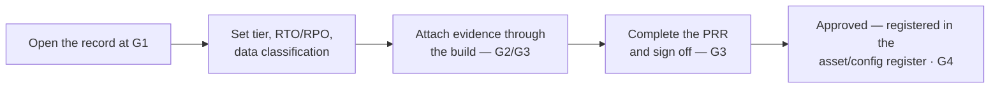

# Readiness record

Each application's gate progress is tracked in a **readiness record** — one per-application
record of tier, decisions, evidence, and sign-off, kept outside this site. The site is the
**guidance**; the readiness record is the **evidence and audit trail** for one application,
from G1 through go-live.

!!! note "Where the record lives"
    The framework is deliberately tool-agnostic about *where* the record is kept — the owning
    team sets the system. What matters is that every application has one durable, auditable
    record of its gates, evidence, and sign-off.

## How it fits the lifecycle

## What the record captures

- **Identity** — application name, delivery team / vendor, product owner, assigned reviewer.
- **Classification** — [criticality tier](../principles/criticality-tiers.md) and justification, plus data classification.
- **Targets** — RTO/RPO and the key NFRs agreed at G1.
- **Evidence** — links to the artifacts each checklist item asks for (repo, PR, test report, STRA, runbook, …).
- **Sign-off** — the four-party [Production Readiness Review](../readiness/production-readiness-review.md) decision, with date and any waivers.

Depth scales by criticality tier: Tier 3 is lightweight; Tier 1/2 require the full review with
evidence attached. Any unmet **MUST** requires a time-boxed **waiver** with an owner and a
remediation date.
