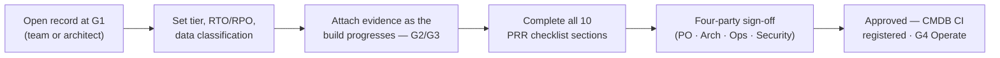

# ServiceNow Readiness Record

The per-project gate is tracked in **ServiceNow**, not in this site. The site is the
guidance; the **Readiness Record** (`u_readiness_record`) is the evidence, sign-off,
and audit trail for every application — and it links to the **CMDB** at go-live.

A record is opened at **G1 (Design)** and follows the application through all four
lifecycle gates. Architecture, Operations/SRE, Security & Privacy, and the Product
Owner each sign off before the record can be **Approved** for go-live.

---

## How it fits the lifecycle

---

## Opening a record

Navigate to **Application Readiness → New Readiness Record** in ServiceNow.
The record number is auto-generated (format: `ARRxxxxxxx`). The only mandatory
field at creation is **Application** — all other fields are filled as the project
progresses.

---

## Field reference

### Identity

| Field | API name | Notes |
|---|---|---|
| Number | `u_number` | Auto-generated. Format `ARR0001001`. Read-only after creation. |
| Application | `u_application` | **Mandatory.** Full application name. |
| Vendor / team | `u_vendor` | e.g. `Acme Digital Services (vendor-built)` or `Internal team` |
| Product Owner | `u_product_owner` | Accountable business owner — signs off at go-live |
| Assigned reviewer | `u_reviewer` | Ops/SRE lead responsible for the review. e.g. `SRE: M. Chen` |

### Classification

| Field | API name | Values |
|---|---|---|
| Criticality tier | `u_criticality_tier` | `1` — Mission-critical · `2` — Business-important · `3` — Supporting |
| Tier justification | `u_tier_justification` | Free text. Record the business reasoning, not just the tier label. |
| Data classification | `u_data_classification` | `public` · `protected_b` · `protected_c` |

See [Criticality Tiers](../principles/criticality-tiers.md) for the classification rules.

### Lifecycle

| Field | API name | Values |
|---|---|---|
| Current gate | `u_current_gate` | `g1` — Design · `g2` — Build · `g3` — PRR · `g4` — Operate |
| Status | `u_status` | `draft` · `in_review` · `conditional` · `approved` |
| Target go-live | `u_target_golive` | Date. Used in the portfolio dashboard. |

### Availability targets

Set with the business at G1. Feed directly into the
[NFR requirements](../design-build/nfrs.md).

| Field | API name | Example values |
|---|---|---|
| RTO (recovery time objective) | `u_rto` | `1 hour` · `4 hours` · `1 day` |
| RPO (recovery point objective) | `u_rpo` | `Near-zero` · `1 hour` · `1 day` |

### Security & Privacy assessments

| Field | API name | Values |
|---|---|---|
| STRA status | `u_stra_status` | `not_started` · `submitted` · `approved` |
| PIA status | `u_pia_status` | `not_required` · `submitted` · `approved` |

### Evidence

| Field | API name | Notes |
|---|---|---|
| Evidence / repo link | `u_evidence_url` | GitHub repo, ADO board, or evidence package URL |
| CMDB CI | `u_cmdb_ci` | Linked CMDB entry. Populated at go-live (G4). Reference to `cmdb_ci`. |
| Outstanding items / waivers | `u_waivers` | Free text. Document gaps, waivers, and remediation owners here. |

### Readiness score

| Field | API name | Notes |
|---|---|---|
| Readiness score (%) | `u_readiness_score` | Integer 0–100. Manually maintained or calculated from checklist completion. |

---

## PRR checklist (10 sections)

Each section maps to a topic area in this framework. Set to **true** (complete) once
the evidence for that area is attached and reviewed.

| # | Field label | API name | Key evidence expected |
|---|---|---|---|
| 1 | Design & decisions | `u_g1_design` | Architecture Decision Records, tier rationale, NFRs signed |
| 2 | Build & supply chain | `u_g2_build` | CI/CD pipeline passing, SAST/SCA/secret scan clean, SBOM generated |
| 3 | Resilience | `u_resilience` | Probes, retries, circuit breakers, graceful shutdown, rolling-update test |
| 4 | Data & DR | `u_data_dr` | Backup strategy, tested restore, RTO/RPO validated |
| 5 | Observability | `u_observability` | Structured logs, metrics, SLIs/SLOs defined, alerts configured |
| 6 | Security & access | `u_security` | STRA approved, pen-test/scan results, RBAC reviewed |
| 7 | Performance | `u_performance` | Load/stress test evidence at agreed NFR thresholds |
| 8 | Operability & support | `u_operability` | Runbook published, on-call model documented, escalation path confirmed |
| 9 | Contractual | `u_contractual` | Vendor SLA, liability, and support coverage confirmed |
| 10 | Cost & sustainability | `u_cost` | Cloud spend baseline, cost alerting, decommission plan |

!!! tip "Tier 3 (Lightweight PRR)"
    Sections 4, 7, 8, 9, and 10 are `SHOULD` for Tier 3. A Tier 3 record can be
    approved with these sections incomplete if the product owner documents the
    acceptance rationale in **Outstanding items / waivers**.

---

## Four-party sign-off

All four sign-offs must be `approve` (or `conditional` with a documented waiver) for
the record status to move to **Approved**.

| Sign-off | API name | Who |
|---|---|---|
| Product Owner sign-off | `u_po_signoff` | Accountable business owner |
| Architecture sign-off | `u_arch_signoff` | Platform/solution architect |
| Operations / SRE sign-off | `u_ops_signoff` | SRE or Operations lead |
| Security & Privacy sign-off | `u_sec_signoff` | Ministry security / privacy officer |

Values: `pending` · `conditional` · `approve` · `reject`

A `reject` on any sign-off blocks approval. The reviewer must document the reason in
**Outstanding items / waivers** and set a remediation owner and date.

---

## Current portfolio (demo records)

The four records below are the live demo data in the developer instance, mirroring
real scenarios. Replace these with your actual portfolio before go-live.

| Number | Application | Tier | Gate | Status | Score |
|---|---|---|---|---|---|
| ARR0001001 | Court Case Management Modernization | 1 | G3 — PRR | In review | 80% |
| ARR0001002 | Permit Lookup Service | 3 | G4 — Operate | **Approved** | 100% |
| ARR0001003 | Benefits Intake Portal | 2 | G1 — Design | Draft | 10% |
| ARR0001004 | Legacy Claims Engine (retrofit gap-assessment) | 1 | G3 — PRR | Conditional | 40% |

These are the same records shown in the [Portfolio Dashboard](../dashboard.md).

---

## Access the record in ServiceNow

| Action | Where |
|---|---|
| **List all records** | Application Readiness → All Readiness Records |
| **New record** | Application Readiness → New Readiness Record |
| **Reports** | Application Readiness → Reports (By Tier · By Status · By Gate) |
| **Direct URL** | `https://dev405419.service-now.com/u_readiness_record_list.do` |

!!! note "Instance URL"
    The developer instance is `dev405419.service-now.com`. Replace with your
    production instance URL before rollout.
