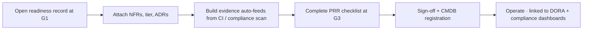

# ServiceNow Process

!!! warning "Stub — to be completed with the ServiceNow team"
    This page describes the *intended* process. The actual record type, fields, and
    workflow must be configured with the ServiceNow team and linked here.

The per-project gate is tracked in **ServiceNow**, not in this site. The site is the
guidance; the ServiceNow record is the evidence, sign-off, and audit trail — and it
links to the **CMDB**.

## Why ServiceNow (and not just the doc)

A reference document doesn't tell us *who applied it to which project*. The readiness
record gives us:

- A per-application record opened at project start.
- A place to attach evidence (test reports, scan results, load-test results, runbook).
- **Sign-off** by product owner, architecture, operations, and security.
- An **audit trail** of who approved what, when.
- A natural link to the **CMDB** entry created at go-live.

## Intended workflow

## To define with the ServiceNow team
- [ ] Record type / form fields mirroring the [PRR](../readiness/production-readiness-review.md)
- [ ] Tier-based conditional sections (lightweight for Tier 3)
- [ ] Approval workflow and required approver roles
- [ ] Link/automation from the CI compliance scan into the record
- [ ] Link to CMDB CI creation at go-live
- [ ] Reporting / dashboard for outstanding gates and waivers
