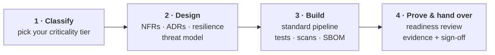

# Start here — for vendors & teams

This page is the **one-page map**. If you are building, deploying, or handing over an
application for us — whether you're an internal team, a contractor, or a vendor — read
this first. It tells you **how to use this framework** and **exactly what we expect you
to deliver**.

!!! tip "The one thing to understand"
    These are **design and build guardrails**, not handover paperwork. Read them at the
    **start** of your project, build to them as you go, and the final review becomes a
    confirmation — not a surprise. Leaving this to the end is the single most common
    reason an application is rejected at go-live.

## How to use this framework in four steps

### Step 1 — Classify your application (Day 1)
Go to **[Criticality Tiers](principles/criticality-tiers.md)** and assign your app a
**Tier 1 / 2 / 3**. This decides which requirements are mandatory for *you*, so you
neither over-build a low-risk tool nor under-build a critical system. Everything else on
this site is right-sized by that tier.

### Step 2 — Design it right (before you write code)
Before solutioning is locked in:

- Capture **[non-functional requirements](design-build/nfrs.md)** — including the
  **RTO/RPO** conversation that drives cost. Use the worksheet.
- Record key decisions as **ADRs** in the repo.
- Plan for **[resilience](design-build/application-resilience.md)** from the start —
  statelessness, timeouts, retries, probes, graceful shutdown.
- Complete a **threat model**; submit the **STRA** (and a **PIA** if you handle personal
  information).

### Step 3 — Build to the guardrails (continuously)
- Use the **standard [CI/CD pipeline template](design-build/cicd-devsecops.md)** — it
  bakes in the mandatory controls (tests + coverage, SAST, SCA, secret scanning, image
  scanning, **SBOM**, artifact **signing**) so you don't assemble them yourself.
- No secrets in source or environment variables with literal values — all runtime secrets **MUST** be stored in and injected from **HashiCorp Vault**.
- Ship structured logs and metrics from day one — observability is not a go-live add-on.

### Step 4 — Prove it and hand it over (before go-live)
Work through the **[Production Readiness Review](readiness/production-readiness-review.md)**.
Every item asks for **evidence — a link, a report, a test result — not a yes/no claim.**
When complete, sign-off is recorded in **[ServiceNow](reference/servicenow-process.md)**
and linked to the CMDB. That record is the audit trail of *who confirmed what, and when*.

---

## What we expect you to deliver

These are the concrete artifacts you are responsible for producing. For vendor-built
applications, the items marked **(SOW)** are **contractual deliverables**, not optional
extras. Which are mandatory depends on your **[tier](principles/criticality-tiers.md)**.

| # | Deliverable | Gate | Notes |
|---|---|---|---|
| 1 | Assigned **criticality tier**, justified | G1 | Drives everything else |
| 2 | Completed **NFR worksheet** (incl. RTO/RPO, perf targets) | G1 | [Template](design-build/nfrs.md) |
| 3 | **Architecture diagram + ADRs** in the repo | G1 | Decisions, not just diagrams |
| 3a | **Solution & feature documentation** — full feature set, existing + new | G1→G3 | **(SOW)** — replaces FDD; whole solution, not just the delta |
| 3b | **Release notes / changelog** — new, changed, removed features | G3 | Old-vs-new always traceable |
| 4 | **Threat model**; STRA (+ PIA if personal info) | G1 | Submitted/approved |
| 5 | Pipeline on the **standard template**, all scans passing | G2 | No unresolved criticals/highs |
| 6 | **Test coverage** meeting the tier threshold — report linked | G2 | **(SOW)** |
| 7 | **SBOM** generated; artifacts **signed** | G2 | **(SOW)** — Tier 1/2 |
| 8 | **Resilience evidence** — incl. *verified zero-downtime rolling update* | G3 | The test that catches most incidents |
| 9 | **Backup + tested restore**; DR/failover tested (Tier 1) | G3 | Meets your stated RPO/RTO |
| 10 | **Observability** — Sysdig dashboards, logs to the Hive, SLIs/SLOs, alerts | G3 | Routed to the on-call owner |
| 11 | **Load/performance test to peak** — meets NFR targets | G3 | Evidence attached |
| 12 | **Runbook** — deploy, rollback, restart, common failures, escalation | G3 | **(SOW)** |
| 13 | **CMDB registration** + agreed, funded support model | G3 | Who supports it, what hours |
| 14 | **Service Desk handover** — notified, call script / knowledge article | G3 | The front line that takes the calls |
| 15 | **Change & release process** + rollback authority | G3 | RFC, release cadence |
| 16 | **SLA** + any third-party support agreements | G3 | **(SOW)** — contractual, not the engineering SLOs |
| 17 | **Defect "tombstone" list** at go-live | G3 | For import into the standard tool |
| 18 | **Maintenance terms** keeping the above true after changes | G3 | **(SOW)** — not a one-time hit |

!!! note "Internal (not a vendor deliverable)"
    Before go-live the ministry/business also confirms an **operating-cost estimate**,
    **Expense Authority approval**, and that **support is funded** — see PRR §10. An
    application with no funded support model will not pass the gate.

!!! info "Use it as a checklist"
    The full, evidence-based version of this list lives on the
    **[Production Readiness Review](readiness/production-readiness-review.md)** page —
    open it early and fill it in as you go.

## What happens if a requirement isn't met

- A `MUST` that isn't met **blocks the relevant gate**.
- An exception is possible only via an **explicit, time-boxed waiver** with a named owner
  and a remediation date, recorded in the ServiceNow readiness record.
- A `SHOULD` you're deviating from must be **justified in an ADR**.

This is not bureaucracy for its own sake — it's how we make sure an application can
actually be operated reliably once it's ours to run.

## Already in production?

If your application is already live (for example, an existing OpenShift app), run the
**[Production Readiness Review](readiness/production-readiness-review.md)** as a
**gap assessment**: score each section, and the gaps become a prioritised remediation
backlog — resilience and observability first.

---

Questions about applying this to a specific project? Contact Architecture &amp; Platform
Engineering — and start the ServiceNow readiness record early.

